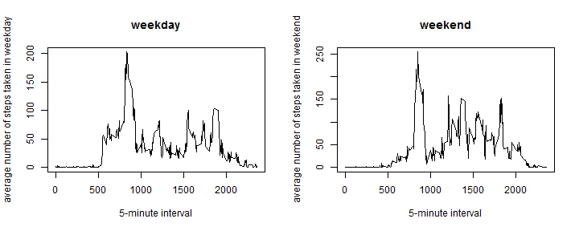

Note: Before you run the .rmd, please make sure you are under the correct working directory

#### Part 1: LOADING AND PREPROCESSING THE DATA

1.Load the data(i.e. read.csv())
        

```r
setwd("C:/Users/Administrator/Desktop/MLDM/Coursera/JHU data science/Reproducible research")
activity <- read.csv("activity.csv",header=TRUE,sep=",")
```

2.change the data frame to a data table


```r
library(data.table)
activity <- data.table(activity)
```

#### Part 2: WHAT IS MEAN TOTAL NUMBER OF STEPS TAKEN PER DAY?

1.Make a histogram of the total number of steps taken each day


```r
sum_steps <- activity[,sum(steps,na.rm=T),by=date]
library(ggplot2)
p <- ggplot(sum_steps,aes(date,V1))+geom_histogram(stat="identity")+ylab("total sum of steps taken per day")
print(p)
```

 

2.Calculate the mean and the median of the total number of steps taken per day


```r
mean_steps <- activity[,mean(steps,na.rm=T),by=date];
colnames(mean_steps) <- c("date","mean")
```

```
## Warning in `names<-.data.table`(`*tmp*`, value = value): The
## colnames(x)<-value syntax copies the whole table. This is due to <- in R
## itself. Please change to setnames(x,old,new) which does not copy and is
## faster. See help('setnames'). You can safely ignore this warning if it is
## inconvenient to change right now. Setting options(warn=2) turns this
## warning into an error, so you can then use traceback() to find and change
## your colnames<- calls.
```

```r
median_steps <- activity[,median(as.double(steps,na.rm=T)),by=date];
colnames(median_steps) <- c("date","median")
```

```
## Warning in `names<-.data.table`(`*tmp*`, value = value): The
## colnames(x)<-value syntax copies the whole table. This is due to <- in R
## itself. Please change to setnames(x,old,new) which does not copy and is
## faster. See help('setnames'). You can safely ignore this warning if it is
## inconvenient to change right now. Setting options(warn=2) turns this
## warning into an error, so you can then use traceback() to find and change
## your colnames<- calls.
```

```r
mean_median_steps <- merge(mean_steps,median_steps,by="date")
```

The mean of the total number of steps taken per day is showed in the following table:


```r
print(mean_median_steps)
```

```
##           date       mean median
##  1: 2012-10-01        NaN     NA
##  2: 2012-10-02  0.4375000      0
##  3: 2012-10-03 39.4166667      0
##  4: 2012-10-04 42.0694444      0
##  5: 2012-10-05 46.1597222      0
##  6: 2012-10-06 53.5416667      0
##  7: 2012-10-07 38.2465278      0
##  8: 2012-10-08        NaN     NA
##  9: 2012-10-09 44.4826389      0
## 10: 2012-10-10 34.3750000      0
## 11: 2012-10-11 35.7777778      0
## 12: 2012-10-12 60.3541667      0
## 13: 2012-10-13 43.1458333      0
## 14: 2012-10-14 52.4236111      0
## 15: 2012-10-15 35.2048611      0
## 16: 2012-10-16 52.3750000      0
## 17: 2012-10-17 46.7083333      0
## 18: 2012-10-18 34.9166667      0
## 19: 2012-10-19 41.0729167      0
## 20: 2012-10-20 36.0937500      0
## 21: 2012-10-21 30.6284722      0
## 22: 2012-10-22 46.7361111      0
## 23: 2012-10-23 30.9652778      0
## 24: 2012-10-24 29.0104167      0
## 25: 2012-10-25  8.6527778      0
## 26: 2012-10-26 23.5347222      0
## 27: 2012-10-27 35.1354167      0
## 28: 2012-10-28 39.7847222      0
## 29: 2012-10-29 17.4236111      0
## 30: 2012-10-30 34.0937500      0
## 31: 2012-10-31 53.5208333      0
## 32: 2012-11-01        NaN     NA
## 33: 2012-11-02 36.8055556      0
## 34: 2012-11-03 36.7048611      0
## 35: 2012-11-04        NaN     NA
## 36: 2012-11-05 36.2465278      0
## 37: 2012-11-06 28.9375000      0
## 38: 2012-11-07 44.7326389      0
## 39: 2012-11-08 11.1770833      0
## 40: 2012-11-09        NaN     NA
## 41: 2012-11-10        NaN     NA
## 42: 2012-11-11 43.7777778      0
## 43: 2012-11-12 37.3784722      0
## 44: 2012-11-13 25.4722222      0
## 45: 2012-11-14        NaN     NA
## 46: 2012-11-15  0.1423611      0
## 47: 2012-11-16 18.8923611      0
## 48: 2012-11-17 49.7881944      0
## 49: 2012-11-18 52.4652778      0
## 50: 2012-11-19 30.6979167      0
## 51: 2012-11-20 15.5277778      0
## 52: 2012-11-21 44.3993056      0
## 53: 2012-11-22 70.9270833      0
## 54: 2012-11-23 73.5902778      0
## 55: 2012-11-24 50.2708333      0
## 56: 2012-11-25 41.0902778      0
## 57: 2012-11-26 38.7569444      0
## 58: 2012-11-27 47.3819444      0
## 59: 2012-11-28 35.3576389      0
## 60: 2012-11-29 24.4687500      0
## 61: 2012-11-30        NaN     NA
##           date       mean median
```

#### Part 3: WHAT IS THE AVERAGE DAILY ACTIVITY PATTERN?

1.The average daily activity pattern


```r
ave_steps <- activity[,mean(steps,na.rm=T),by=interval]
plot(ave_steps,type="l",xlab="5-minute interval",ylab="average number of steps taken")
```

 

2.find 5-minute interval which contains the maximum number of steps:


```r
ind <- which.max(ave_steps$V1)
max_interval <- ave_steps$interval[ind]
```

The 5-minute interval on average across all the days in the dataset contains the maximum number of steps is 835

#### Part 4: IMPUTING MISSING VALUES

1.Calculate and report the total number of missing values in the dataset (i.e. the total number of rows with NAs)


```r
count <- sum(is.na(activity$steps))
```

The total number of missing values in the dataset is 2304

2.Create a new dataset that is equal to the original dataset but with the missing data filled in. NOTE: using for loop to do this but I think there is a better way.


```r
new_activity <- activity;
for(i in 1:nrow(new_activity)){
        if(is.na(activity$steps)[i]==T){
                Ind2 <- which(ave_steps$interval==new_activity$interval[i]);
                new_activity$steps[i] <- ave_steps$V1[Ind2]
        }
}
```

3.make a histogram of steps taken each day of the new dataset


```r
sum_steps2 <- new_activity[,sum(steps),by=date]
p <- ggplot(sum_steps2,aes(date,V1))+geom_histogram(stat="identity")+ylab("total sum of steps taken per day")
print(p)
```

 

4.report the mean and median total number of steps taken per day of the new dataset


```r
s2 <- new_activity[,mean(steps),by=date]
median_step2 <- new_activity[,median(as.double(steps)),by=date]
```

as we can see, the values are differ from what we have seen in part one and the impact is: there is no NA any longer, which all be replaced by the average fo 5-interval minute

#### Part 5: ARE THERE DIFFERENCES IN ACTIVITY PATTERNS BETWEEN WEEKDAYS AND WEEKENDS?

1.Create a new factor variable in the dataset with two levels ¨C ¡°weekday¡± and ¡°weekend¡± indicating whether a given date is a weekday or weekend day.


```r
library(lubridate)
new_activity$weekdays <- wday(as.Date(new_activity$date))
Indweekday <- which(new_activity$weekdays!=6 & new_activity$weekdays!=7)
new_act_weekday <- new_activity[Indweekday,]
Indweekend <- which(new_activity$weekdays==6 | new_activity$weekdays==7)
new_act_weekend <- new_activity[Indweekend,]
```

2.Make a panel plot containing a time series plot (i.e. type = "l") of the 5-minute interval (x-axis) and the average number of steps taken, averaged across all weekday days or weekend days (y-axis). 


```r
par(mfrow=c(1,2))
ave_steps_weekday <- new_act_weekday[,mean(steps),by=interval]
plot(ave_steps_weekday,type="l",xlab="5-minute interval",ylab="average number of steps taken in weekday",main="weekday")

ave_steps_weekend <- new_act_weekend[,mean(steps),by=interval]
plot(ave_steps_weekend,type="l",xlab="5-minute interval",ylab="average number of steps taken in weekend",main="weekend")
```

 
From this two figures we can see that there are some sifferences in activity patterns between weekdays and weekends. 
